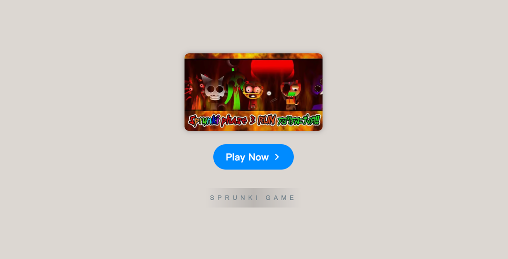

# Sprunki Phase 3

    

Welcome to **[Sprunki Phase 3](https://sprunkionline.com/phase/3)**, an immersive music-making experience within the world of Sprunki! This phase offers a delightful twist on the core Incredibox gameplay, allowing you to craft your own unique musical creations through a variety of sounds and beats in an artistic and engaging setting. Explore the lively visuals, character interactions, and endless musical possibilities that make Sprunki a favorite among fans.

### Table of Contents
- Introduction
- Features
- Installation
- Gameplay Overview
- Sprunki Phases
- Popular Modes & Mods
- Tips for Success
- Resources

### Introduction

**[Sprunki Phase 3](https://sprunkionline.com/phase/3)** takes the classic Incredibox gameplay to a new level by integrating exclusive characters, vibrant graphics, and fresh sounds. Whether you're an Incredibox veteran or a first-time player, this phase offers something exciting for everyone. Dive into the world of Sprunki, where your musical imagination can truly come to life.

### Features

| Feature                  | Description                                                                             |
|--------------------------|-----------------------------------------------------------------------------------------|
| **Character Variety**    | Choose from a range of unique Sprunki characters, each adding a distinct musical layer. |
| **Interactive Gameplay** | Drag-and-drop mechanics make sound layering and beat creation intuitive and fun.       |
| **Sprunki Visuals**      | Dynamic animations and colorful effects enhance the immersive experience.               |
| **Free Access**          | No download needed—play directly in your browser for free.                             |
| **Community Sharing**    | Record and share your creations with friends or the wider Sprunki community.           |

### Installation

The **Sprunki Phase 3** game is fully browser-based, so no installation is required. To start creating your beats, follow these simple steps:

1. **Open Your Browser**: Compatible with Chrome, Firefox, Safari, and other modern browsers.
2. **Visit the Website**:
    - [Sprunki Phase](https://sprunkionline.com/category/sprunki-phase)
    - [Sprunki Phase 3](https://sprunkionline.com/phase/3)
3. **Begin Playing**: Click "Play" to dive into the Sprunki world and start mixing beats.

### Gameplay Overview

Sprunki Phase 3 invites players to create layered musical compositions by selecting and arranging animated characters on a soundboard. Here’s a quick guide to getting started:

1. **Select Characters**: Each character represents a unique sound, including vocals, bass, and melodies.
2. **Drag and Drop**: Place characters on the soundboard to build your composition.
3. **Layer Sounds**: Combine characters to produce complex musical tracks with layered effects.
4. **Visual Effects**: Enjoy dynamic animations that respond to your music.
5. **Record & Share**: Once complete, record your track and share it with the Sprunki community.

### Sprunki Phases

Each phase of Sprunki introduces new characters, sounds, and styles, allowing players to continuously experiment and evolve their creations:

| Phase               | Description                                                                                |
|---------------------|--------------------------------------------------------------------------------------------|
| **[Sprunki Phase 3](https://sprunkionline.com/phase/3)**    | Brings classic Sprunki sounds with new combinations.                                 |
| **[Sprunki Phase 4](https://sprunkionline.com/phase/4)**    | Adds richer sounds and effects for a deeper musical experience.                       |
| **[Sprunki Phase 5](https://sprunkionline.com/phase/5)**    | Darker tones and "infected" characters for an intense vibe.                           |
| **[Sprunki Phase 6](https://sprunkionline.com/phase/6)**    | Advanced sound options for creators looking for a modern twist.                       |

### Popular Modes & Mods

Enjoy fan-favorite modes and mods to customize your Sprunki experience:

- **Sprunki Infected Mod**: Experiment with darker, moodier beats with "infected" characters.
- **Sprunki Mustard Mod**: A fan favorite that introduces unique sound elements for added variety.
- **Sprunki Cocrea**: Engage with others by sharing and combining compositions in a collaborative setting.
- **Sprunki Parasprunki**: Layered interactions with parasitic characters for complex sound effects.

### Tips for Success

- **Experiment with Combinations**: Try out various character combinations to find new and interesting sounds.
- **Watch Tutorials**: Find helpful guides on YouTube to master different phases and features.
- **Connect with the Community**: Share your compositions and get feedback from other players.

### Resources

Explore additional phases, mods, and resources to expand your Sprunki experience:

- [Sprunki Phase](https://sprunkionline.com/category/sprunki-phase)
- [Sprunki Phase 3](https://sprunkionline.com/phase/3)

Enjoy creating your own musical masterpiece in Sprunki Phase 3!
